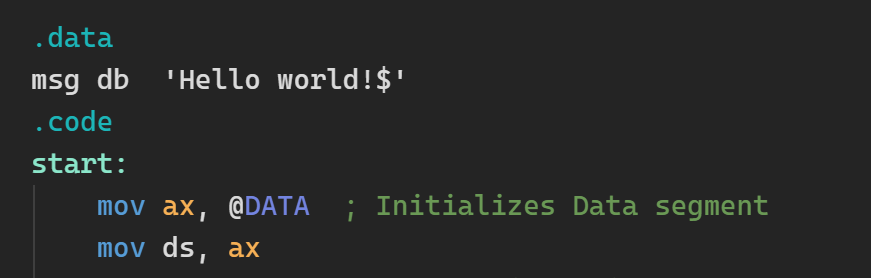

# ASM highlight

修改自 https://github.com/91ac0m0/obsidian-asm-syntax-highlight 
- 适应最新版 Obsidian

## 功能

Obsidian 插件，提供汇编语言高亮功能。


## 使用

在项目目录下运行
```sh
npm install
npm run build
```
得到 main.js 

在 Obsidian 仓库下的 .obsidian/plugins/ 下创建插件目录 obsidian-asm-syntax-highlight

将此目录下的
- manifest.json
- main.js
- styles.css
复制到插件目录

